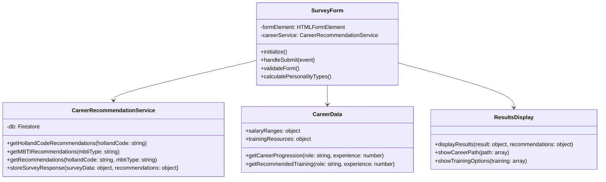
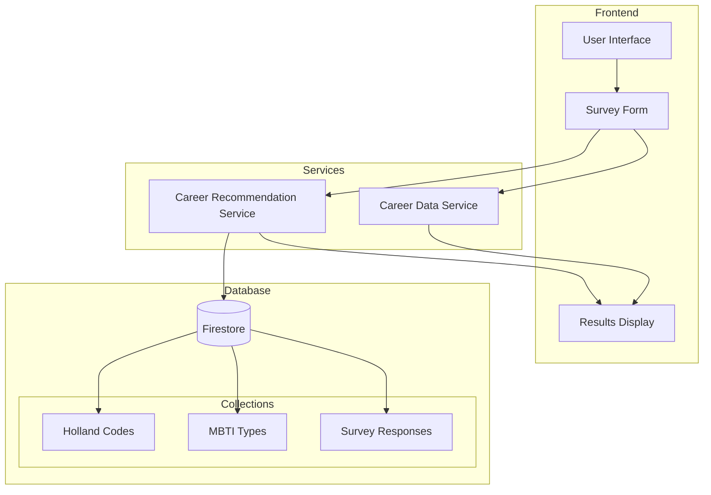
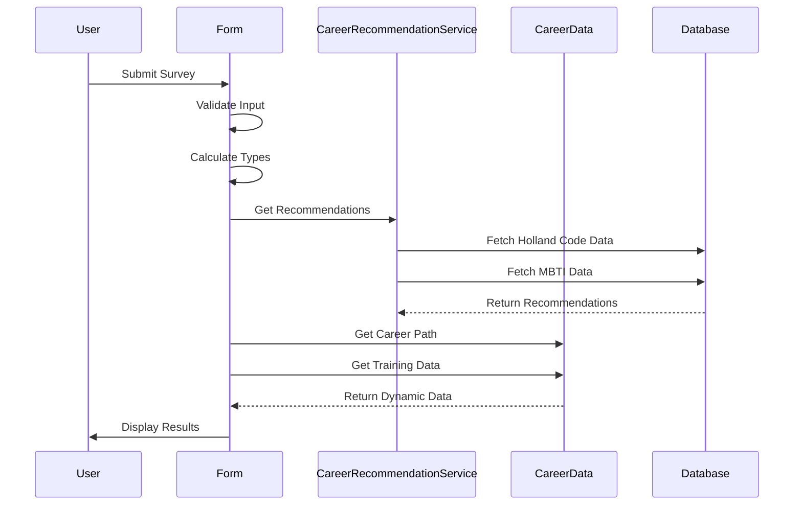

# System Architecture

## UML Diagrams

### Class Diagram

### Component Diagram

### Sequence Diagram

## Data Flow

### Survey Submission
1. User fills out form
2. Form validates input
3. Calculates personality types
4. Fetches recommendations
5. Displays results

### Data Updates
1. Static Data (Database)
   - Update through setup script
   - Validate changes
   - Deploy to Firestore

2. Dynamic Data (Code)
   - Update constants
   - Test changes
   - Deploy through git

## Security Architecture

### Authentication
- Firebase Authentication
- Role-based access
- Secure API endpoints

### Data Protection
- Encryption at rest
- Secure transmission
- Regular backups

## Monitoring

### Performance
- Page load times
- API response times
- Database queries

### Error Tracking
- Client-side errors
- Server-side errors
- API failures

## Scaling Considerations

### Database
- Indexing strategy
- Query optimization
- Caching layer

### Application
- Code splitting
- Lazy loading
- Resource optimization
